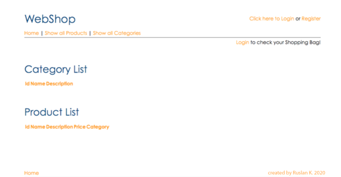
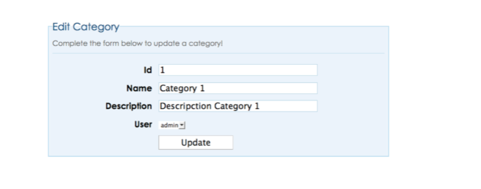
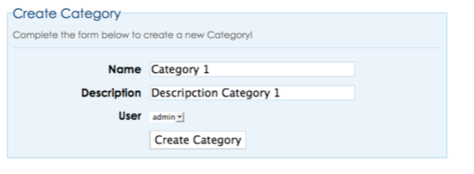
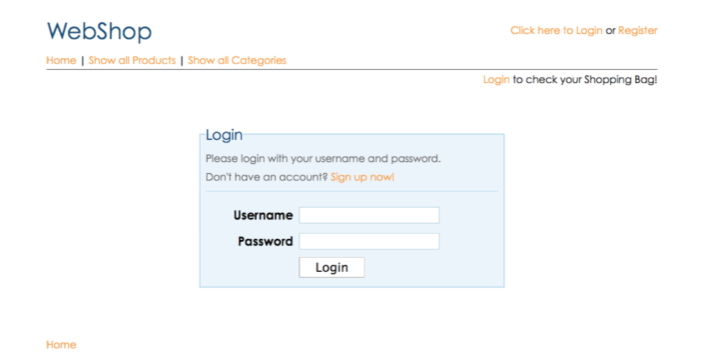
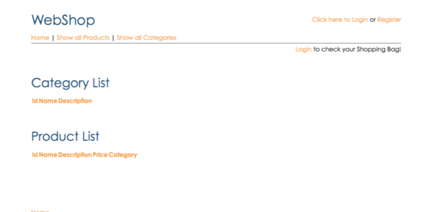
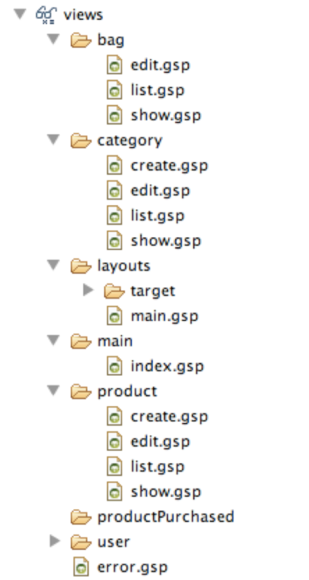
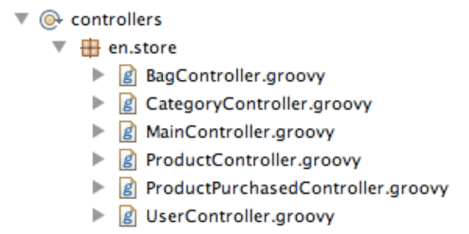
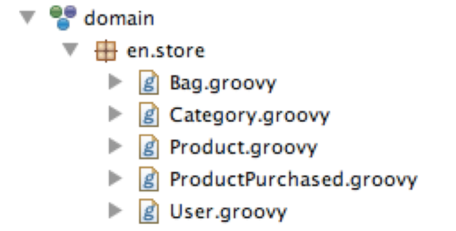

# E-commerce web application with Grails - by Ruslan 2020

This is an example of a ecommerce website (online shop, online store) developed completely using Grails. 

## Screenshots

## Introduction
The goal of this project is to develop a web application using Grails.
To develop this project I have been using STS (SpringSource Tool Suite) for Mac OSX and the version of grails is 1.3.7.

## Author
Ruslan Kozbovsky

